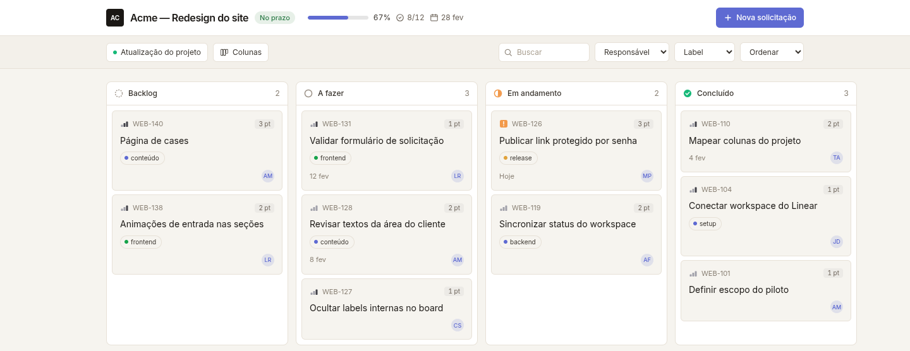
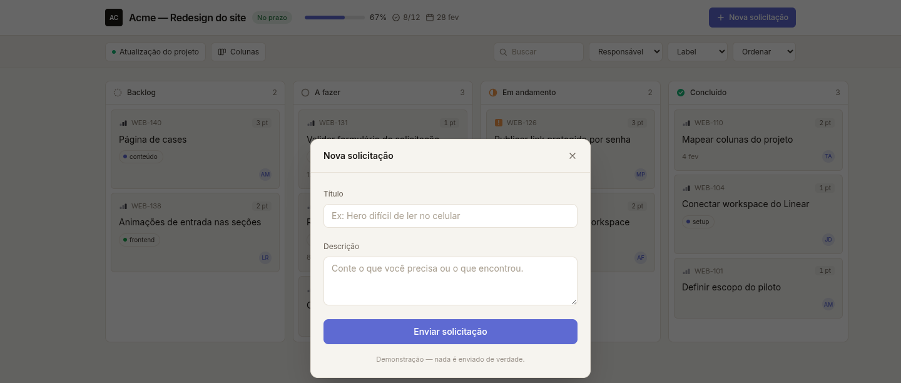

<div align="center">

# Quodra

### Share a live Linear board with clients — without giving them a Linear seat.

Quodra turns any Linear project into a clean, **password-protected** board your clients and stakeholders actually enjoy reading — and lets them file requests straight into your triage queue. **Fast, simple, self-hosted, and yours.**


<br>



<sub><em>What your client sees: a live, read-only board — no Linear seat, no internal noise.</em></sub>

</div>

---

## Why Quodra

Your clients want to know **what's shipping and when**. Linear is where the work lives — but a seat per stakeholder is expensive, noisy, and exposes your entire workspace. Quodra is the **translation layer**: it publishes exactly the slice of a project you choose, as a fast read-only board on your own domain.

- 🔒 **Secure by default** — every link is password-protected (or explicitly public). Internal labels, statuses, estimates, assignees, due dates and priorities are stripped **server-side**, so hidden data never reaches the browser.
- ⚡ **Fast** — live Linear data, cached in-memory and served by a lightweight Nitro server. Boards open instantly.
- 🎨 **White-label** — put your client's name and logo on their board. It looks like yours, not like a tool.
- 📥 **Two-way** — stakeholders submit triage requests that land as real issues in your Linear project. No account required.
- 🧩 **Simple** — five environment variables and one `docker compose up`. The Postgres schema bootstraps itself.
- 🏠 **Private & self-hosted** — runs entirely on your infrastructure. Nothing is sent to third parties. One instance, one admin, one Linear workspace.
- ✅ **Reliable** — fully typed, 91 passing tests, built-in rate-limiting and automatic connection retries.

## How it works

1. **Connect** your Linear workspace with a single personal API key.
2. **Create a link** in the admin panel — pick a project, set a password (or make it public), hide whatever the client shouldn't see, add their logo.
3. **Share** the URL. Your client opens a live board at `https://your-domain/s/<slug>` and can submit requests that flow straight back into Linear.

<div align="center">



<sub><em>Stakeholders file requests in one click — they land as issues in your Linear triage queue, no account required.</em></sub>

</div>

## Quick start

**Prerequisites:** Docker + Docker Compose, and a [Linear personal API key](https://linear.app/settings/account/security/api-keys/new) (Settings → API → Personal API keys → **Create key**).

```bash
git clone https://github.com/matheuscamposmt/quodra.git
cd quodra
cp .env.example .env      # fill in the 5 values below
docker compose up -d --build
```

Open `http://localhost:3001`, sign in at `/login` with your `NUXT_ADMIN_PASSWORD`, and create your first link. The database schema is created automatically on first boot.

### Configuration

| Variable | Purpose |
|---|---|
| `NUXT_PUBLIC_SITE_URL` | Public origin where the app is served (no trailing slash). Builds your `/s/<slug>` URLs. |
| `NUXT_LINEAR_API_KEY` | Your Linear personal API key. |
| `NUXT_ADMIN_PASSWORD` | Password that gates the admin panel (`/login`). |
| `NUXT_SESSION_PASSWORD` | Secret that seals the session cookie — 32+ chars (`openssl rand -hex 32`). |
| `NUXT_DATABASE_URL` | Postgres connection string. Set automatically by `docker compose` for local runs. |

## Tech stack

- **[Nuxt 3](https://nuxt.com)** full-stack on the Nitro `node-server` preset
- **PostgreSQL** + **[Drizzle ORM](https://orm.drizzle.team)**
- **[nuxt-auth-utils](https://github.com/atinux/nuxt-auth-utils)** for the sealed session · **bcrypt** for link passwords
- **[@linear/sdk](https://developers.linear.app)** for the Linear API

## Development

```bash
npm install
npm run dev      # http://localhost:3001
npm test         # vitest — 91 tests
npm run build    # production bundle
```

## Contributing

Issues and pull requests are welcome. Quodra is intentionally small and focused — if you're adding a feature, open an issue first so we can keep it that way.

## License

[MIT](./LICENSE) © Quodra
